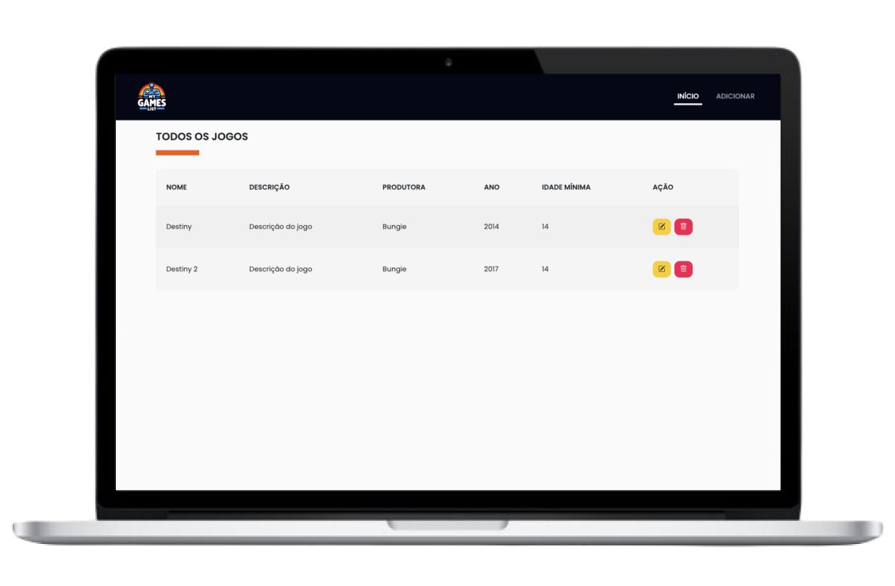
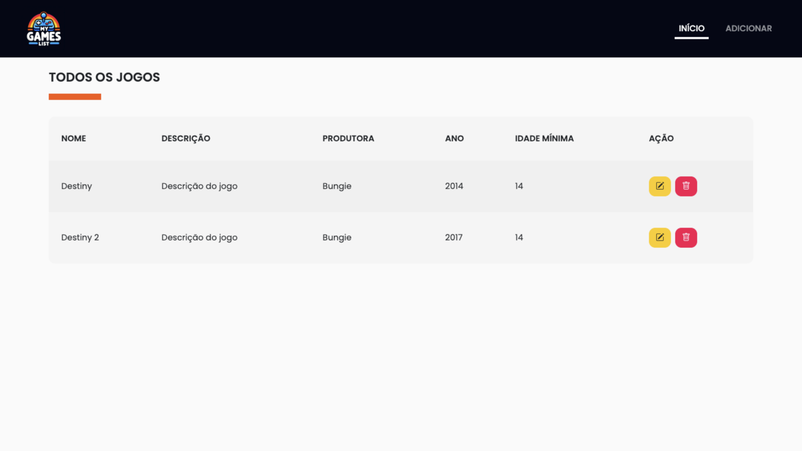
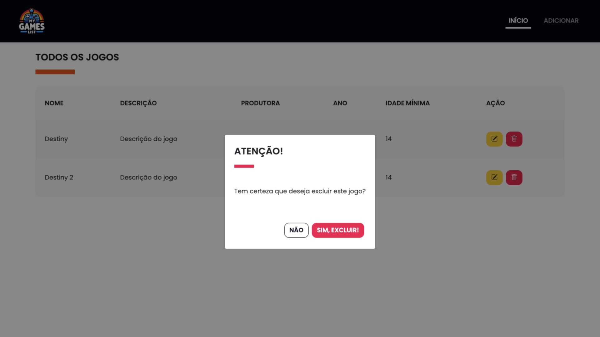
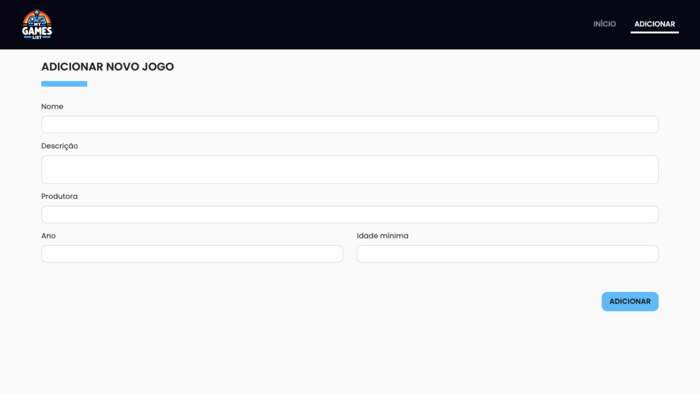
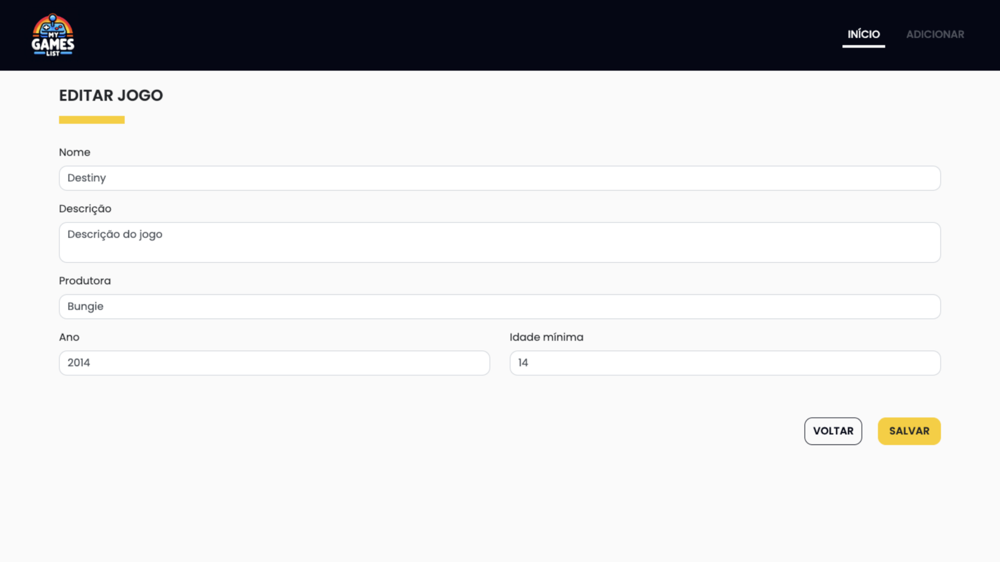

<h1 align="center">
  
</h1>
<br>

<p align="center">
  
</p>
<br>

## Sobre o projeto 💬

O **MyGamesList** é uma aplicação completa de CRUD (Create, Read, Update, Delete) para gerenciar jogos. Além das operações básicas de CRUD, o sistema inclui validações robustas, tratamento de erros detalhado, responsividade e uma interface de usuário intuitiva, tudo isso mantendo uma separação clara entre Backend e Frontend.

## Funcionalidades 🧠

A aplicação contém as seguintes funcionalidades:

- Criar jogo
- Obter lista de todos os jogos
- Obter informação de um jogo específico
- Atualizar informação de um jogo específico
- Excluir um jogo específico
- Validação de erros

## Frontend 🎭

O Frontend foi projetado com tecnologias e bibliotecas para proporcionar uma experiência de usuário de alta qualidade.

A estruturação da página foi feita com HTML, a estilização foi feita com CSS e SASS, proporcionando uma gestão de estilos mais eficiente e modular.

A interatividade foi desenvolvida com JavaScript puro e jQuery, e para garantir uma aparência responsiva, foi utilizado o Bootstrap.

Além disso, a validação dos formulários foi otimizada com o jQuery Validation, e o Toastify foi utilizado para dar feedbacks ao usuário.

### Páginas 📃

Todas as páginas possuem feedback visual para a operações de CRUD por meio de `toasts`. Além disso, contam com validações de dados e tratamento de erros para todas as requisições.

#### Início

A página inicial possui uma lista de todos os jogos cadastrados no sistema e oferece opções de editar e excluir.

<p align="center">
  
</p>
<p align="center">
  
</p>

#### Adicionar novo jogo

A página de adicionar novo jogo possui um formulário para que a adição de um novo jogo possa ser feita.

<p align="center">
  
</p>

#### Editar jogo

A página de editar novo jogo possui um formulário para que a edição de um novo jogo possa ser feita.

<p align="center">
  
</p>

### Como utilizar? 📌

Para utilizar a aplicação em sua máquina é necessário ter instalado:

- [Node.js](https://nodejs.org/pt-br/)
- [Yarn](https://yarnpkg.com/) (opcional)

Com os softwares essenciais instalados, basta seguir os seguintes passos para executar a aplicação em sua máquina:

1. **Clonar o projeto** <br>
   Abra o terminal em um diretório de sua preferência e cole o seguinte código: _`git clone https://github.com/vinixiii/my-games-list.git`_

2. **Entrar na pasta <ins>/frontend</ins>** <br>
   Abra o diretório clonado e utilize o seguinte comando no terminal: _`cd frontend`_

3. **Intalar as dependências** <br>
   Dentro do diretório do projeto instale as dependências pelo terminal com _`npm install`_ ou _`yarn`_

4. **Executar o app** <br>
   Dentro do diretório do projeto abra o terminal e digite o comando _`npm run dev`_ ou _`yarn dev`_

Pronto! O servidor estará rodando e poderá ser acessado no seguinte endereço:
`http://localhost:3000`

Com isso, será possível utilizar a interface para gerenciar os jogos.

## Backend 👾

O Backend foi desenvolvido utilizando Node.js com o framework Express, e foi escrito em TypeScript para proporcionar tipagem estática e melhor manutenção.

Para garantir a integridade e validação dos dados, o Zod foi adotado, oferecendo uma camada robusta de validação de esquemas.

### Modelo de dados 🎲

```ts
interface Game {
  id: string;
  name: string;
  description: string;
  developedBy: string;
  year: number;
  minimumAge: number;
}
```

### Rotas 🧭

#### GET: /api/games

Descrição:

Retorna todos os jogos

Exemplo de sucesso:

```
Status code:
200

Corpo da resposta:
true
```

#### GET: /api/games/:id

Descrição:

Retorna a informação de um jogo específico

Exemplo de sucesso:

```
Status code:
200

Corpo da resposta:
true
```

#### POST: /api/games

Descrição:

Adiciona um novo jogo

Parâmetros:

| Parâmetro   | Tipo   | Descrição                 | Exemplo                                           |
| ----------- | ------ | ------------------------- | ------------------------------------------------- |
| name        | string | Nome do jogo              | "Rocket League"                                   |
| description | string | Descrição do jogo         | "Jogo que combina elementos de corrida e futebol" |
| developedBy | string | Produtora do jogo         | "Psyonix"                                         |
| year        | number | Ano de lançamento do jogo | 2015                                              |
| minimumAge  | number | Idade mínima recomendada  | 15                                                |

Exemplo de payload:

```
{
  "name": "Rocket League",
  "description": "Jogo que combina elementos de corrida e futebol",
  "developedBy": "Psyonix",
  "year": 2015,
  "minimumAge": 15
}
```

Exemplo de sucesso:

```
// Supondo que o payload tenha sido como no exemplo acima...

Status code:
200

Corpo da resposta:
123 // <- Id do jogo criado
```

#### PUT: /api/games

Descrição:

Atualiza os detalhes de um jogo existente

Parâmetros:

| Parâmetro   | Tipo   | Descrição                 | Exemplo                                           |
| ----------- | ------ | ------------------------- | ------------------------------------------------- |
| id          | number | Nome do jogo              | 123                                               |
| name        | string | Nome do jogo              | "Rocket League"                                   |
| description | string | Descrição do jogo         | "Jogo que combina elementos de corrida e futebol" |
| developedBy | string | Produtora do jogo         | "Psyonix"                                         |
| year        | number | Ano de lançamento do jogo | 2015                                              |
| minimumAge  | number | Idade mínima recomendada  | 15                                                |

Exemplo de payload:

```
{
	"id": 123
	"name": "Rocket League",
	"description": "Jogo que combina elementos de corrida e futebol",
	"developedBy": "Psyonix",
	"year": 2015,
	"minimumAge": 15
}
```

Exemplo de sucesso:

```
// Supondo que o payload tenha sido como no exemplo acima...

Status code:
200

Corpo da resposta:
true
```

#### DELETE: /api/games/:id

Descrição:

Retorna a informação de um jogo específico

Exemplo de sucesso:

```
Status code:
200

Corpo da resposta:
true
```

### Tratamento de erros 🐛

A API conta com um middleware global para tratamento de erros e um middleware para validação de payload que contém respostas detalhadas para diferentes cenários de erro.

#### Resposta de erro geral

Exemplo:

Considere uma operação de `DELETE` para `/api/games/:id`, onde o `id` passado não se refere a nenhum jogo. Teremos o seguite retorno da API:

```
Status code:
400

Corpo da resposta:
{
	"message": "Jogo não encontrado!"
}
```

#### Resposta de erro para operações de criação e atualização

Considere uma operação de `POST` para `/api/games`, onde o payload não está correto. Teremos o seguite retorno da API::

```
// Supondo que o payload tenha sido:
// {
//		"name": "Rocket League",
//  	"description": "",
//  	"developedBy": "Psyonix",
//		"year": 2015,
//		"minimumAge": "15",
//		"extraField": "Campo extra"
// }

Status code:
400

Corpo da resposta:
{
	"formErrors": {
		"invalidFields": [ // <- Campos que não são esperados
			"extraField"
		]
	},
	"fieldErrors": { // <- Campos que não estão no formato correto
		"description": [
			"O campo [description] não deve ser vazio"
		],
		"minimumAge": [
			"O campo [minimumAge] deve ser um número"
		]
	}
}
```

### Como utilizar? 📌

Para utilizar a aplicação em sua máquina é necessário ter instalado:

- [Node.js](https://nodejs.org/pt-br/)
- [Yarn](https://yarnpkg.com/) (opcional)

Com os softwares essenciais instalados, basta seguir os seguintes passos para executar a aplicação em sua máquina:

1. **Clonar o projeto** <br>
   Abra o terminal em um diretório de sua preferência e cole o seguinte código: _`git clone https://github.com/vinixiii/my-games-list.git`_

2. **Entrar na pasta <ins>/backend</ins>** <br>
   Abra o diretório clonado e utilize o seguinte comando no terminal: _`cd backend`_

3. **Intalar as dependências** <br>
   Dentro do diretório do projeto instale as dependências pelo terminal com _`npm install`_ ou _`yarn`_

4. **Executar o app** <br>
   Dentro do diretório do projeto abra o terminal e digite o comando _`npm run dev`_ ou _`yarn dev`_

Pronto! O servidor estará rodando e poderá ser acessado no seguinte endereço:
`http://localhost:3333`

Com isso é possível fazer requisições para essa URL combinando o **path** e o **método HTTP** desejado.

## Tecnologias e ferramentas 🛠

O Frontend foi desenvolvido utilizando as seguintes tecnologias e ferramentas:

- [HTML](https://developer.mozilla.org/pt-BR/docs/Web/HTML)
- [CSS](https://developer.mozilla.org/pt-BR/docs/Web/CSS)
- [Javascript](https://developer.mozilla.org/pt-BR/docs/Web/JavaScript)
- [Bootstrap](https://getbootstrap.com/)
- [Sass](https://sass-lang.com/)
- [jQuery](https://jquery.com/)
- [jQuery Validation](https://jqueryvalidation.org/)
- [Toastify](https://apvarun.github.io/toastify-js/)

O Backend foi desenvolvido utilizando as seguintes tecnologias e ferramentas:

- [Typescript](https://www.typescriptlang.org/)
- [Node.js](https://nodejs.org/pt-br/)
- [Express](https://expressjs.com/pt-br/)
- [Zod](https://zod.dev/)

---

<p align="center">Feito com ❤ por: Vinícius Figueiroa 🙋🏻‍♂️</p>
